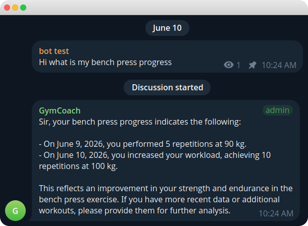
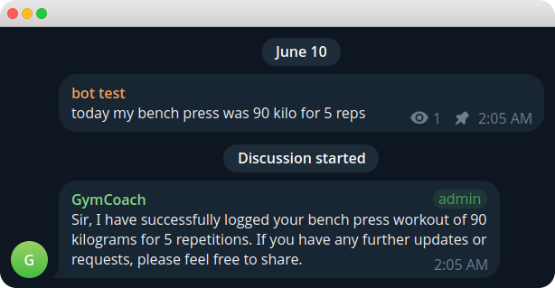
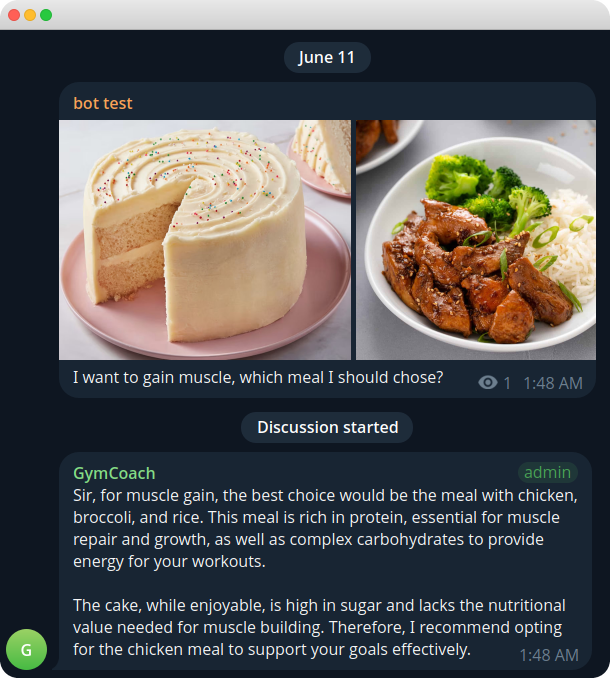
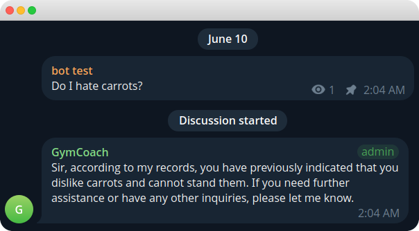

# GymTGBot

A Telegram AI agent for tracking gym progress. It replies in isolated chat threads, remembers long-term facts, stores workout history, and analyzes photos.

<p align="center">
  
</p>

## Features

* Keeps conversations isolated by chat and thread.
* Uses a tool-calling loop and can call multiple tools in a single response.
* Analyzes photos, including meals and physique updates.
* Stores long-term memory, such as injuries, preferences, and recurring issues.
* Tracks workout history, including weights, reps, and progression.

## Architecture

* `handlers/` and `middleware/` — Telegram integration powered by `aiogram`.
* `services/` — business logic and application services.
* `tools/` — LLM tool functions, such as `add_workout`, `query_workout`, and others.
* SQLite — workout tracking and isolated thread memory.

## Requirements

* Python 3.12+
* [uv](https://docs.astral.sh/uv/)
* Telegram Bot API token
* OpenAI API token

## Telegram Setup

Before running the bot, prepare the Telegram side:

1. Create a Telegram **channel**.
2. Create a **discussion group** and link it to the channel
   (Channel → *Manage Channel* → *Discussion* → add/link a group).
3. Add your bot as an **administrator** of the channel.
4. Add your bot as an **administrator** of the linked discussion group.

This is required because the bot operates inside the channel's discussion
threads, where each topic/thread is kept isolated.

## Installation and Running

```bash
uv sync                      # Install dependencies
cp .env.example .env         # Fill in the required environment variables
```

Then complete the **Telegram Setup** steps above (create the channel,
link a discussion group, and add the bot as an admin to both).

```bash
uv run python -m gym_tg_bot  # Start the application
```

## With Docker

Requires only Docker — no local Python or uv. Still create `.env` and
complete the **Telegram Setup** steps above first.

```bash
cp .env.example .env          # Fill in BOT_TOKEN and OPENAI_API_KEY
docker compose up -d --build  # Build the image and start the bot
docker compose logs -f        # Follow logs
docker compose down           # Stop the bot
```

Application data (the SQLite database and Qdrant storage) lives in a named
volume mounted at /app/data, so it persists across container restarts and
rebuilds.

## Development

```bash
uv run pytest                               # Run tests
uv run ruff format . && uv run ruff check . # Format and lint
uv run mypy src tests                       # Run type checks
```

## Screenshots

<table>
  <tr>
    <td align="center">
      <br>
      <sub>Logging workouts</sub>
    </td>
    <td align="center">
      <br>
      <sub>Analyzing meal photos</sub>
    </td>
  </tr>
  <tr>
    <td align="center">
      <br>
      <sub>Recalling long-term facts</sub>
    </td>
    <td align="center">
      <br>
      <sub>Tracking workout history</sub>
    </td>
  </tr>
</table>
